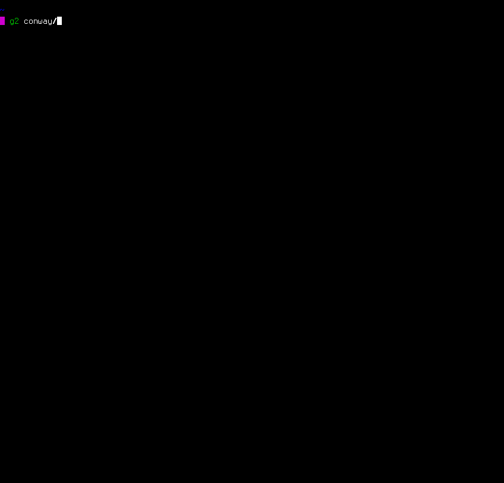

# conway [](https://travis-ci.org/samtay/conway)
A terminal interface for playing Conway's Game of Life




This is just a pet project that I thought would be a good exercise in Haskell.
The [Game of Life](https://en.wikipedia.org/wiki/Conway's_Game_of_Life) is a cellular automaton
with simple rules but emergent complexity - a quintessential complex system.
The frontend leverages [brick](http://hackage.haskell.org/package/brick)
while the backend is supported by custom zipper types implementing comonads.

This codebase comes with a complementary article about the [performance benefits of comonads](https://samtay.github.io/posts/comonadic-game-of-life.html).

### installation
First [get stack](https://docs.haskellstack.org/en/stable/README/#how-to-install). Then
```shell
$ git clone https://github.com/samtay/conway.git
$ cd conway
$ stack build
# execute via stack
$ stack exec life
# alternatively, copy executable to ~/.local/bin
$ stack install life
$ life
```
